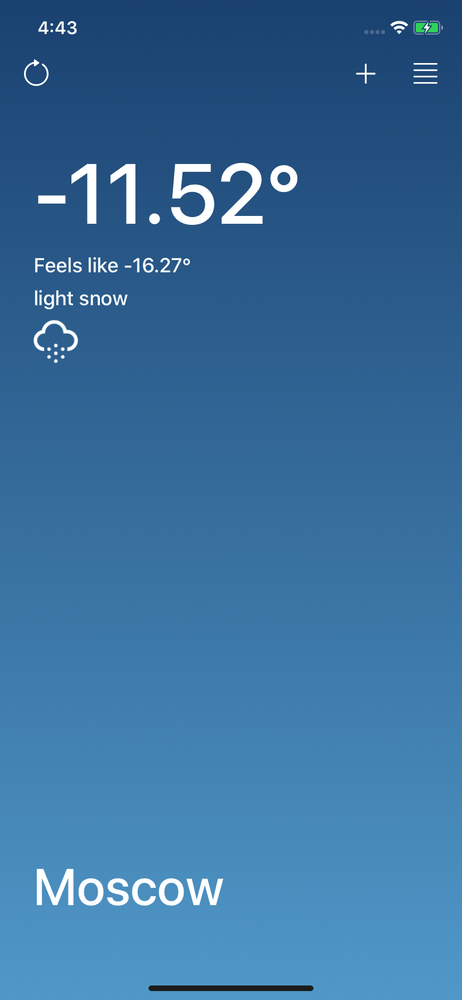

# СWeather
Uses OpenWeatherMap API to access current weather data in JSON format for current location.

# Used
- Model-View-Controller architecture
- JSON parsing
- Getting current data from OpenWeatherMap API
- Getting current location and reverse geocoding using Core Location
- HTTP requests with URLSession
- Unit Tests

# Screenshots

