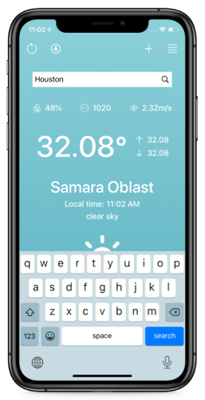
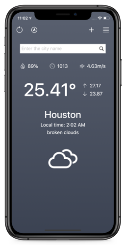
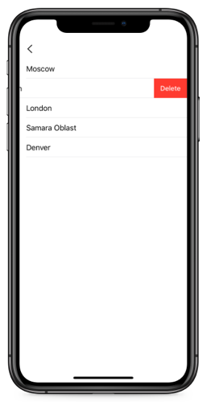

# Weather-App
## Description
- A weather app created using [openweathermap API](https://openweathermap.org/)
### Video: [youtube link](https://youtu.be/tZBzEiAMpFk)

## Features
- Get current location
- Search any location
- Add location to favorites/Delete location from favorites
- Get current weather information
- Refresh weather information
- Change background by local time

## Used
- MVC architecture
- UIKit
- Auto Layout
- RealmDatabase
- API Networking with URLSession
- CoreLocation
- CAGradientLayer
- CocoaPods
- Unit Tests

## Screenshots
  
